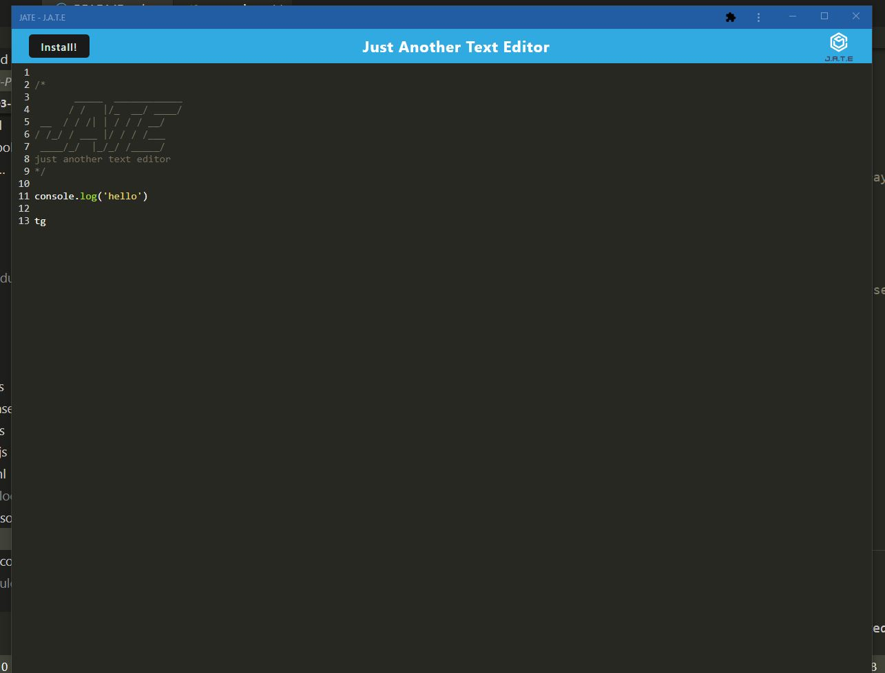

# Just Another Text Editor (J.A.T.E.)

### [Description](#description) | [Features](#features) | [Images](#images) | [Links](#links) | [Setup](#setup) | [Usage](#usage) | [Credit](#credit) | [Contact](#contact)

## Description
This is a simple text editor created using PWA's that works in a browser or installed to work offline

## Features

- The ability to download and used as a app
- Ability to work offline by saving to a database that persists after reload 

## Images 

## Links
Link to heroku deployed site
 
## Setup
- Set up requires you to npm run install
- then npm run build
- then npm run start:dev
- open in browser http://localhost:3000/

## Usage
- A simple text editor that can be used to create code that persists after reload

## Project Status
Project is: _complete_

## Room for Improvement

Room for improvement:
- Cleaning up code

## Credit 
- Huge Credit to Juan Piedra for help with implmenting the offline feature correctly!
- Find Juan on Github juan-piedra and a link to her repo that helped me complete this project. https://github.com/juan-piedra
- Biggest thanks to Micheal for encouraging me to not give up!

## Contact
Created by TristanM225 Reach out to me by email! TristanM225@gmail.com

